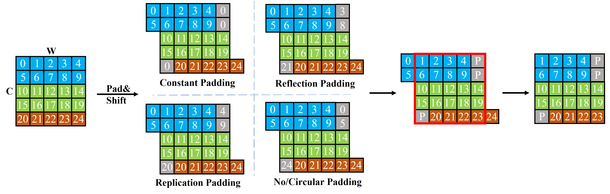

# PSVMLP: point and shifted voxel MLP For 3D deep learning



<!-- by [Mutian Xu*](https://mutianxu.github.io/), [Runyu Ding*](), [Hengshuang Zhao](https://hszhao.github.io/), and [Xiaojuan Qi](https://xjqi.github.io/). -->
by Guanghu Xie, Yang Liu*, Yiming Ji, Zongwu Xie, Baoshi Cao

## Introduction
This repository is built for the official implementation of:

__PAConv__: point and shifted voxel MLP For 3D deep learning 

## Object Classification(ModelNet40)

### Dataset
Download and unzip [ModelNet40](https://shapenet.cs.stanford.edu/media/modelnet40_ply_hdf5_2048.zip) (415M). Then symlink the paths to it as follows (you can alternatively modify the path [here](https://github.com/CVMI-Lab/PAConv/blob/main/obj_cls/util/data_util.py#L10)):
``` 
mkdir -p data
ln -s /path to modelnet40/modelnet40_ply_hdf5_2048 data
```

### Train:
``` 
python main.py --config config/psvmlp_train.yaml
```  

### Test:
```
python eval_voting.py --config config/psvmlp_test.yaml`
```   

## Object Classification(ScanObjectNN)

The dataset will be automatically downloaded from [ScanObjectNN](https://web.northeastern.edu/smilelab/xuma/datasets/h5_files.zip)

```bash
cd classification_ScanObjectNN
# train
python main_part_seg.py --model psvmlp
```

By default, it will create a fold named "checkpoints/{modelName}-{msg}-{randomseed}", which includes args.txt, best_checkpoint.pth, last_checkpoint.pth, log.txt, out.txt.


## Part segmentation(ShapeNet)


- Make data folder and download the dataset from [ShapeNet](https://shapenet.cs.stanford.edu/media/shapenetcore_partanno_segmentation_benchmark_v0_normal.zip).
```bash
cd part_segmentation
mkdir data
cd data
wget https://shapenet.cs.stanford.edu/media/shapenetcore_partanno_segmentation_benchmark_v0_normal.zip --no-check-certificate
unzip shapenetcore_partanno_segmentation_benchmark_v0_normal.zip
```

- Train PSVMLP
```bash
# train PSVMLP
python main.py --config config/psvmlp_partseg_train.yaml
# please add other paramemters as you wish.
```

- Test PSVMLP
```bash
# test PSVMLP
python main.py --config config/psvmlp_partseg_test.yaml
# please add other paramemters as you wish.
```

## Pre-trained models
Our pre-trained models are available at [here](https://drive.google.com/drive/folders/1t7oLOHfqVtREWWVfLpa8Njby-d_ni_hu?usp=drive_link)


## Acknowledgment

Our implementation is mainly based on the following codebases. We gratefully thank the authors for their wonderful works.

[PointMLP](https://github.com/ma-xu/pointMLP-pytorch),
[PAConv](https://github.com/CVMI-Lab/PAConv),


## LICENSE
PSVMLP is under the Apache-2.0 license. # psvmlp
